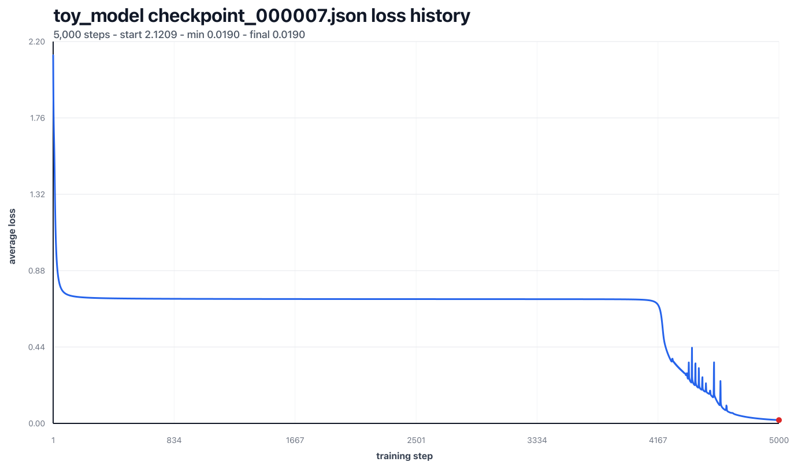

# Hellm-world

This repository serves as a project to learn LLM's from first principles for [me](https://its.beer).

Currently this is a work-in-progress and no working models exist yet in this repository.

## No vibe-coding or dependencies

The goal is to not use any AI-generated code or dependencies for the actual inference & training logic. Instead, I intend to write every single line myself; after fully understanding why it's written like that.

❌ Not allowed to be touched by coding agents:
* Inference logic
* Training logic
* LLM harnass

✅ allowed to be touched by coding agents:
* Unit tests
* Infrastructure scripts like chart generation

## JS-tradeoffs

I know JS is not optimal for heavy linear algebra and mathematics. But, I'm here to learn at the highest speed possible; and am most comfortable in JS. Thus the choice to write in this.

## Timmy - a 16k model

I've written about the process of training the model here: [http://its.beer/thoughts/training-timmy](http://its.beer/thoughts/training-timmy).

